# Media Services high availability sample

## Overview

This high availability (HA) solution covers a Video on Demand (VOD) workflow where a media file is uploaded for encoding to produce a multi-bitrate streaming asset that is then published for end customers to view.

Azure Media Services encoding service is a regional batch processing platform and not designed for high availability within a single region. The service currently does not provide instant failover if there is a regional data center outage or failure of an underlying component or dependent services (such as storage or networking). This sample shows how to deploy Media Services to maintain a high-availability architecture with failover and ensure optimal availability for your applications.

## High level architecture

Following diagram describes main components of this solution.

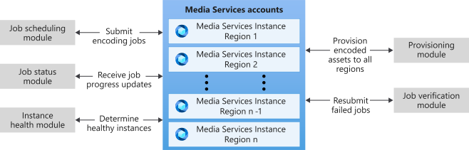

### Media services cluster

The Media Services cluster consists of two or more Media Services accounts. These accounts need to be in different regions.

### Job scheduling module

The job scheduling module submits new jobs to the Media Services cluster. It tracks the health status of each Media Services instance and submits a new job to the next healthy instance.

### Job status module

The job status module listens to job output status events coming from the Azure Event Grid service. It stores events to an event store to minimize the number of calls to Media Services APIs by the rest of the modules.

### Instance health module

The instance health module tracks submitted jobs and determines the health status for each Media Services instance. It tracks finished jobs, failed jobs and jobs that never finished.

### Provisioning module

The provisioning module provisions processed assets. It copies asset data to all Media Services instances and sets up the Azure Front Door service to ensure that assets can be streamed even when some Media Services instances are not available. It also sets up streaming locators. It is easy to remove or add provisioning steps to address a specific business scenario.

### Job verification module

The job verification module tracks each submitted job, resubmits failed jobs and performs job data clean up once the job is successfully finished.

## Set up the sample

This section describes steps to set up this sample.

### Prerequisites

- An Azure subscription
- [PowerShell with Azure PowerShell Az module](https://docs.microsoft.com/powershell/azure/new-azureps-module-az?view=azps-4.1.0)
- .NET Core 3.1 or later
- An installation of Visual Studio 2019

Perform following steps:

1. Clone or download this code.
1. Modify the deployment script configuration file located in *ARMDeployScripts/all.parameters.json*.
    1. Set the `deploymentNameBase`, for example *contosoha*.
    1. Set the `deploymentRegionLocation` to the region where all the sample components will be installed, for example *eastus*.  
    1. Set the `keyVaultTenantId` to the Azure tenant Id. It can be found in the Azure AD admin center > properties page > Directory ID.
    1. Set the `amsRegions`. You can have two or more regions specified. List all the regions where you want to install a Media Services instance. One Media Services instance will be installed per region.
    1. Save the file *all.parameters.json*.
1. Decide on a resource group name and resource group location for the sample. This location specifies where the resource group metadata is stored. It doesn't have to match the location where the actual components are deployed. Component location is specified by `deploymentRegionLocation` above.
1. Open a PowerShell window and run `deploy.ps1 -ResourceGroupName <ResourceGroupToCreate> -ResourceGroupLocation <location>`.  

There are two separate ARM scripts, *main.json* and *Event Gridsetup.json*. They both are called from *deploy.ps1*. It is done in two steps so that the Media Services accounts and the Azure Functions are available when setting up the Event Grid subscriptions. The following components are deployed using the *main.json* script:

- Multiple Media Service accounts in different regions, one per region
- Multiple streaming endpoints, one per media service account
- Multiple storage accounts associated with media service accounts
- An App Service plan
- Multiple App Services (one per module described above)
- A storage account to host Azure Queues
- A CosmoDB account to host Azure Tables
- A Front Door to route traffic to streaming endpoints
- A Key Vault service to store secrets
- Application Insights to store logs.

Sometimes the script fails to deploy everything correctly from the first try and some errors may be displayed. The reason that script sometimes fails is because we use managed identities for azure functions and that takes a while to provision.  There is retry logic built into the script to retry failed steps. After the *main.json* script is deployed successfully, the sample is compiled and Azure functions are deployed to App Services.

### Test requests

#### Copy the key vault name

Once *deploy.ps1* finishes, copy key vault name, it is listed at the end of the script output. Then, perform following steps to submit test requests.

#### Submit test requests

Update the Key Vault configuration to grant access to user submitting test requests:

1. Go to [Azure Portal](http://portal.azure.com/).
1. Open the newly created resource group.
1. Open the Key Vault instance.
1. Go to **access policies**.
1. Click on **Add access policy**.
1. Select the *Get* and *List* secret permissions.
1. Select **user** in the select principal dialog.
1. Click **Add** to add access the policy.
1. Click **Save** to save the change in Access Policies.
1. Open Visual Studio 2019.
1. Open the *HighAvailability.sln* solution file.
1. Open the *HighAvailabiltity.Tests/E2ETests.cs* file from *HighAvailability.Test* project.
1. Find the `configService = new E2ETestConfigService("<enter keyvault name>");` line and edit the parameter value with key vault name that was listed at the end of *deploy.ps1* script output.
1. Open the *E2ETests.cs* file.
1. Find  the `private static JobRequestModel GenerateJobRequestModel(int sequenceNumber, string uniqueness)` function and add edit the asset source link.
1. In the Visual Studio solution explorer, right-click on *E2ETests.cs* file and select **Run Tests**. It will run the `SubmitTestRequests` method which will initialize the sample environment and submit ten job requests.

Once the requests are submitted, following actions will happen:

1. The Job scheduling module will read submitted job requests from the job-requests queue and submit them to the Media Services instances.
1. Once the jobs are finished, provisioning requests will be submitted to the provisioning-requests queue.
1. Once provisioning requests are processed, provisioning completed events are posted to provisioning-completed-events queue.

After successful processing of test results, the provisioning-completed-events queue should contain the same number of events as submitted job requests. Each event will have provisioning result data.

There are several different ways to see which Media Services instance processed a given job:

1. All logs are sent to Application Insights, it is possible to see what instance processed each job by searching for the `JobSchedulingService::SubmitJobAsync successfully created job` message. It contains all the submitted job metadata including the unique identifier and instance name information.
1. The `MediaServiceCallHistory` table in CosmoDB contains data about all calls to the Media Services API.

## Detailed architecture review

This section describes the entire architecture in more detail. Even though this sample is built using Azure Functions and Azure Storage components, all dependencies are abstracted, and it is easy to replace specific a component implementation using a different platform.

### Azure Storage

Azure storage is used to host queues. Queues are used to send and receive messages to coordinate activities among different modules. Classes implementing access to Azure storage can be found in the *HighAvailability/AzureStorage* folder.

### Azure Functions

Azure Functions are used to host each module. Some of them are triggered by new messages in the queues and some of them are triggered by a schedule. Each function implementation is a lightweight class that uses a specific service class to implement all business logic. It is easy to replace the Azure Function service with a different application service technology.

There are five Azure Functions in this sample:

- `InstanceHealthFunction` hosting the Instance Health Module, source code folder */HighAvailability.InstanceHealth*
- `JobOutputStatusFunction` hosting the Job Status Module, source code folder */HighAvailability.JobOutputStatus*
- `JobSchedulingFunction` hosting the Job Scheduling Module, source code folder */HighAvailability.JobScheduling*
- `JobVerificationFunction` hosting Job Verification Module, source code folder */HighAvailability.JobVerification*
- `ProvisioningFunction` hosting Provisioning Module, source code folder */HighAvailability.Provisioning*

Azure Functions use a dependency injection pattern to setup all of the objects. See [Use dependency injection in .NET Azure Functions](https://docs.microsoft.com/azure/azure-functions/functions-dotnet-dependency-injection).

Azure Functions use managed identities to authenticate to Media Services instances.

### Job scheduling module details

This module is responsible for processing incoming job requests.

1. A new job request is submitted to the job-requests-queue using the  `JobRequestStorageService` class. This implementation is using the Azure Queue service, but a different service can be implemented using the  `IJobRequestStorageService` interface.
1. The `JobSchedulingFunction` is triggered to process the new incoming request.
1. The job request is submitted to the `JobSchedulingService` class.
1. The next available instance is loaded from `MediaServiceInstanceHealthService`.
1. The output asset is created using the Media Services client.
1. The Media Services API call status is recorded for instance health calculation.
1. The job is submitted using the Media Services client.
1. The Media Services API call status is recorded for instance health calculation.
1. The specific Media Services instance usage is recorded. This enables round robin instances.
1. The job output status is stored using `JobOutputStorageService`.
1. The job verification request is submitted to check the job processing status in the future.

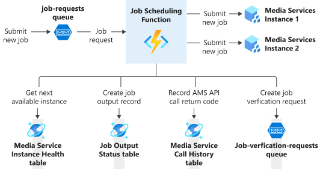

The following Azure PaaS components are used in this module:

1. The job-requests queue is Azure Queue.
1. The job scheduling function is an Azure Function.
1. The Job Scheduling module is hosted by a job scheduling Azure Function. It is triggered by messages in the job-requests queue.
1. The Media Service Instance Health data is stored in an Azure CosmoDB table.
1. The Job Status data is stored in an Azure CosmoDB table.
1. The Media Service Call History data is stored in an Azure CosmoDB table.
1. The job-verification-requests queue is Azure Queue.

### Job output status module details

This module is responsible for persisting job output status events to storage. It is triggered by events coming from Azure Event Grid service. Storing and reusing the job output status data from Event Grid messages reduces the number of redundant calls to Media Services and improves both reliability and latency.

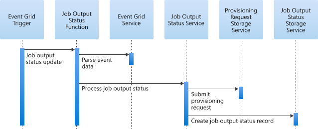

1. The job output status function is triggered by a new event from Azure Event Grid service.
1. The `Event GridService` class is used to parse event data.
1. `JobOutputStatusService` is called to process the event.
1. If the output status indicates that the job output has completed, a new provisioning request is submitted to process assets.
1. The job output status is persisted using the storage service.

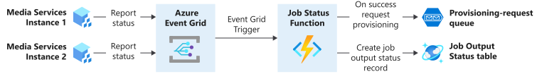

Following Azure PaaS components are used in this module:

1. Media Services instances send job output status events to the Azure Event Grid service.
1. A job status Azure Function subscribes to receive these events.
1. Job output status data is stored in an Azure CosmoDB table.
1. The provisioning-request queue is Azure Queue.

### Provisioning module details

This module is responsible for the provisioning of processed assets. The `ProvisioningOrchestrator` object contains list of `ProvisioningService` instances and they are called one by one to provision each asset. Three provisioning services are included in this sample: `AssetDataProvisioningService`, `ClearStreamingProvisioningService` and `OutputEncryptionStreamingProvisioningService`. List of services is specified in *HighAvailability.Provisioning/Startup.cs*, provisioning logic can be customized by removing any of the services from the list or adding new services.

#### AssetDataProvisioningService

The Media Services job stores asset output to an asset container hosted by the Azure Storage service. Since the processing job is submitted to a single Media Services instance, job output is stored to the Azure Storage associated with that Media Services instance only. At streaming time, if the Azure region that hosts specific Azure Storage instance is not available, assets are also not available from that instance.

`AssetDataProvisioningService` copies processed assets to all Media Services instances to enhance data availability. Azure Front Door service is used to manage traffic among all Media Services instances.

#### ClearStreamingProvisioningService

The `ClearStreamingProvisioningService` creates streaming locators for clear content in each Media Services instance to enable asset consumption through Azure Front Door service. This enables continuous streaming when Azure region becomes unavailable.

#### OutputEncryptionStreamingProvisioningService

`OutputEncryptionStreamingProvisioningService` creates streaming locators with output encryption in each Media Services instance to enable asset consumption through Azure Front Door service. This enables continuous streaming when Azure region becomes unavailable.

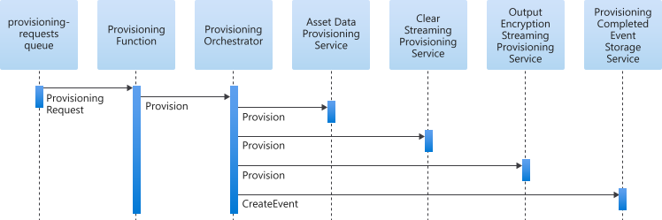

1. The provisioning function is triggered by the request coming from provisioning-requests queue.
1. The provisioning function calls the `ProvisioningOrchestrator` to provision assets.
1. `ProvisioningOrchestrator` iterates through all registered `ProvisioningService` objects to provision assets. It is easy to add or remove `ProvisioningService` in this list to implement custom business logic.
1. After successful provisioning of assets, a provisioning completed event is created to indicate that assets are ready to be used.

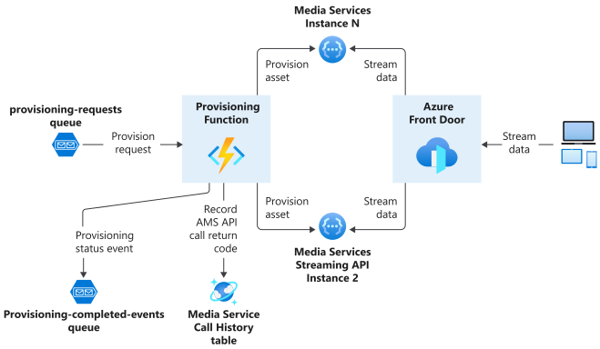

1. The provisioning-request queue is Azure Queue.
1. The provisioning function is an Azure Function that is triggered by messages coming from the provisioning-requests queue.
1. The provisioning-completed-events queue is Azure Queue.
1. Media Service Call History data is stored in an Azure CosmoDB table.
1. Traffic is routed to different Media Services instances using Azure Front Door service.

### Job verification module details

This module verifies that jobs are completed successfully. If a job fails, it is resubmitted to the next healthy Media Services instance.

#### Job verification success and failure sequence diagrams

This diagram covers scenario when job is completed successfully.

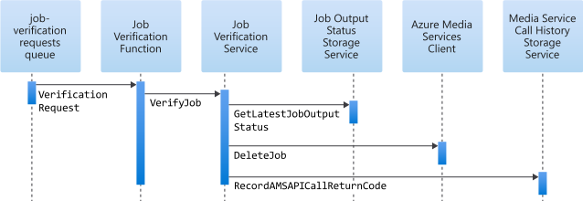

1. The job verification queue message triggers the job verification Azure Function.
1. The function calls `JobVerificationService` to verify the job.
1. The service checks job status in `JobOutputStatusStorageService`.
1. If a job is finished, the job is deleted from the Media Services instance to clean up resources.
1. The Media Services API call status is recorded for instance health calculation.

This diagram covers scenario when job has failed.

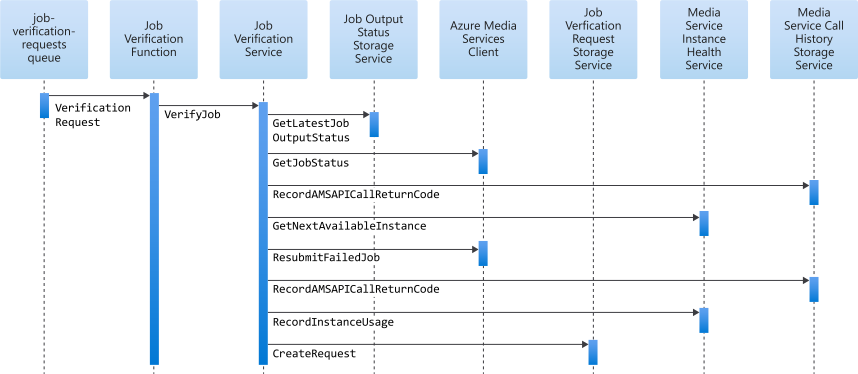

1. The job verification queue message triggers the job verification Azure Function.
1. The function calls `JobVerificationService` to verify the job.
1. The service checks job status in `JobOutputStatusStorageService`.
1. If the job status is not final (Finished, Error or Canceled), it could mean that the Event Grid event has been delayed or lost. Media Services API is called to pull the latest job status.
1. The Media Services API call status is recorded for instance health calculation.
1. If the job status is *error* and the error has happened because of a system problem, then the job is resubmitted.
1. The Media Services API call status is recorded for instance health calculation.
1. If the job is resubmitted, instance usage is recorded, and a new job verification request is created to run through the same sequence for this new job in the future. The job verification request is created with delayed visibility using Azure Queue.

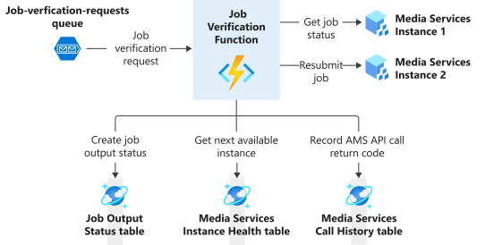

1. The job-verification-requests queue is an Azure Queue.
1. The job verification function is an Azure Function that is triggered by a request on job-verification-requests queue.
1. The job output status data is stored in an Azure CosmoDB table.
1. The Media Service Instance Health data is stored in an Azure CosmoDB table.
1. Media Service call history data is stored in an Azure CosmoDB Table.

### Instance health module details

This module evaluates the health status of each Media Services instance. It uses job output status history to determine if a given Media Services instance is healthy, degraded or unhealthy. This information is used to find the next available Media Services instance when processing new jobs.

Two data sources are used to determine Media Services instance health:

1. **The history of recently submitted jobs.** The number of successfully completed jobs is compared with total number of processed jobs. If a job gets stuck (not completed over predefined period of time since submission) or errors out because of problems with infrastructure, it is counted against Media Services instance health.
1. **The history of all recent calls made to Media Services API.** If a call fails with an *http 5xx* error, it is counted against Media Services instance health.

The *lower* value of the two indicators is taken to determine the overall Media Services instance health. Current implementation does not take into consideration *in progress* status updates from Event Grid. It is looking for *completed* or *failed* status and it only checks overall elapsed time to determine if the job is stuck. Extending this solution to take *in progress* status updates is also possible, but not demonstrated here.

This module is also responsible for "re-syncing" missing job output status records from job output storage. This can happen when events from Event Grid service are lost. The re-sync function uses an optimized algorithm to minimize the number of calls to Media Services APIs.

#### Instance Health sequence diagrams

This diagram covers Media Services instance health status evaluation scenario.

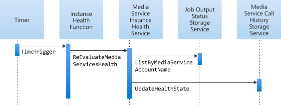

1. The timer triggers the instance health Azure Function. It runs every 10 minutes by default.
1. The instance health Azure Function calls the `MediaServiceInstanceHealthService` object to reevaluate the Media Services Health with `ReEvaluationMediaServicesHealth`.
1. `MediaServiceInstanceHealthService` loads all job output status records generated over the last six hours for a given Media Services instance. This list is used to determine the health state of the Media Services instance.
1. The Media Services instance is *healthy* if the percentage of successfully completed jobs are higher than the configurable value.
1. The Media Services instance is *unhealthy* if the percentage of successfully completed jobs are lower than the configurable value.
1. The rest of the Media Services instances are set to degraded state.

This diagram covers Job Output Status Re-sync scenario. This scenario is important when events from Azure Event Grid service are delayed or lost.

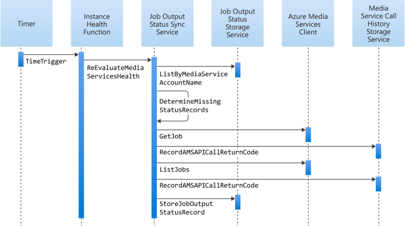

1. The timer triggers the instance health Azure Function. It runs every fifteen minutes by default.
1. `JobOutputStatusSyncService` is used to process the re-sync request.
1. `MediaServiceInstanceHealthService` loads all job output status records generated over last six hours for a given Media Services instance.
1. All jobs that have not reached final state (Finished, Error, Cancelled) and have not had a status update over last x number of minutes (configurable) are marked for status *resync*.
1. The number of calls is determined to resync the status using individual `get` calls and `list` calls. The approach that generates fewer calls to Media Services APIs is selected to refresh all missing status records.
1. All Media Services API call status records are stored for instance health calculation.
1. Refreshed job output status records are stored using `JobOutputStatusStorageService`.

1. The timer triggers the instance health Azure Function.
1. The job output status data is stored in an Azure CosmoDB table.
1. Media Service instance health data is stored in an Azure CosmoDB table.
1. Media Service call history data is stored in an Azure CosmoDB table.

### Error Handling

This sample is implemented using Azure Queues and Azure Functions. Each Azure Function is triggered either by message in the queue or timer. In most cases all Azure Functions are idempotent. There are two exceptions. The job scheduler function and the job verification function may create duplicate jobs in Media Services if they fail - *after* the job is created in Media Services, but *before* the functions finish the rest of the processing. It is unlikely to happen since all errors are caught and not thrown again in that part of the code. If it does happen, it may result in the same job being processed twice.

If the error happens in a queue trigger-based Azure Function, the message stays in the queue and the Azure Function is triggered again with the same message. By default, if the Azure Function fails five times for the same message, it is moved to the poison queue. Once the root cause of failure is determined and fixed, the message could be moved back to the queue for reprocessing. See [Azure Functions error handling](https://docs.microsoft.com/azure/azure-functions/functions-bindings-error-pages) for more details.

If the error happens in the timer trigger-based Azure Function, it will rerun the same function during next scheduled time. The timer based function is idempotent and running this function again after failure will not cause any side effects.

The job scheduler function will fail if there are no healthy Media Services instances available. If that happens, all incoming job requests will fail and will be moved to the poison queue. After the Media Services instances recover, all failed requests can be moved back to the queue for reprocessing.

## Failure Modes

This section covers different failure scenarios and provides guidance how to improve current solution:

1. **The Media Services batch processing fails in a specific instance/region, Media Services API is still available in failed region.**
    1. If the job processing pipeline is completed before failure, assets have been replicated to other regions, streaming is not impacted, and Azure Front Door routes requests to healthy region.
    1. If the job processing pipeline is not completed before failure, but it marks a job as failed with a system error, the job is resubmitted to healthy region.
    1. If the pipeline doesn't mark the job as failed, the job is stuck. The job verification function checks the stuck job several times and eventually skips the request. A `LogWarning` is logged to telemetry explaining the situation with a suggestion to manually verify if a job was processed correctly.
1. **The Media Services region has a broad failure where the API and the job pipeline are down.**
    1. For new incoming job requests, the job scheduling module looks at the list of all available Media Services instances to submit a new job. If a failed instance is selected, the job scheduling function fails and retries later. Failure is logged to `MediaServiceCallHistoryStorageService`. The `InstanceHealth` module uses this failure to recalculate instance health. If enough requests fail, the Media Services instance is marked as *degraded* and it will not be selected for next job. By default, the same job request is retried five times. If all five tries are not successful, the job request message is moved to the poison queue. Messages from the poison queue will have to be manually resubmitted to prevent the loss of any incoming job requests.
    1. For existing job requests that are being processed by a failed region, the job verification module uses the Media Services API to check the status (if status is stale in local storage) and it uses the Media Services API to resubmit the job. Since all calls to the Media Services API fail, the request will be retried and after five retries they will go to the poison queue. Messages from the poison queue will have to be manually resubmitted to prevent the loss of any *in process* job requests.
    1. The provisioning module uses the Media Services API to create the output asset and streaming locators. If the Media Services API is not available for a given region, the provisioning request will fail, and the message will go to the poison queue after five retries. A single provisioning request is used to orchestrate provisioning to all the regions. Failure in any region stops the whole provisioning process for a given request. To finish provisioning, the region must come back, and a message must be resubmitted from the poison queue. Alternatively, the same job can be resubmitted and processed by a healthy region. The provisioning module doesn't use instance health to determine where to provision processed assets. To exclude the failed region from provisioning rotation, a manual configuration change must be made, the `AMSConfiguration` application that sets the configuration parameter value must be changed to remove the failed region in the provisioning function. See the section below on how to manually resubmit failed jobs. Extending the current implementation to use a separate provisioning request per region would make this solution more flexible, but more complex.
    1. Streaming uses Azure Front Door to route traffic to an available instance. By default, Azure Front Door routes traffic to the closest instance. If that instance isn't available, the next instance is selected. **Note:** *Azure Front Door only routes traffic coming to the  Streaming Endpoint, it doesn't route key delivery traffic. If the Streaming Endpoint is available in a given region, but key delivery service is not, encrypted data streaming will not work. To address this scenario, that region should be taken out of rotation by taking down the Streaming Endpoint or modifying Azure Front Door configuration to exclude the Streaming Endpoint. Extending the solution to use Front Door on the key delivery URL is also possible but not demonstrated here.*  
1. **The region where the high availability solution is installed fails.** Currently this solution is not setup for high availability. Depending on the current environment, one or multiple steps could be implemented to make it more available:
    1. Provision CosmoDB with a high availability configuration to host all tables (job output status, instance health and call history).
    1. Provision a main storage account to use geo replication. That account hosts all queues (job-requests, job-verification-requests, provisioning-requests and provisioning-completed-events). Manual failover could be used to restore access in a different region. Alternatively, Service Bus can be used to host queues and a Services Bus high availability solution could be implemented.
    1. Either deploy other components ahead of time or set them up after the region fails (App Service plan, App Services, Key Vault, App Insights).

### Manually submit jobs using log data

Use these steps to manually resubmit failed or stuck jobs.

1. Find the job request data. Raw JSON data is logged for each request that is received in job-requests queue. Search for the `JobSchedulingService::SubmitJobAsync started: jobRequestModel` log message in App Insights with the specific job name.
1. Submit the JSON data from above step as the queue message for the job-requests queue.

## Customization options

There are several different ways how sample can be customized.

### Using existing the Azure Storage and Azure Function setup

This is the fastest way to start using this sample. All the components are automatically deployed by the script. The following components should be reviewed and updated to address specific business scenarios:

1. Depending on the business scenario, a new transform for processing jobs may need to be created. The initial transform is created in the *E2ETests.cs* file.
1. `ProvisioningOrchestrator` has a list of `ProvisioningServices`. Current implementation copies all processed assets to all Media Services instances and sets up streaming locators with and without output encryption. Both of these components can be updated to provision assets in a different way.
1. Depending on the max job size, `NumberOfMinutesInProcessToMarkJobStuck` and `TimeDurationInMinutesToVerifyJobStatus` configuration values should be updated. (See the Modifying or extending the sample section below for more details.)

### Implement custom storage for queue and table data

If using custom storage is required, the following interfaces must be implemented:

1. `IJobOutputStatusStorageService`
1. `IJobRequestStorageService`
1. `IJobVerificationRequestStorageService`
1. `IMediaServiceInstanceHealthStorageService`
1. `IProvisioningCompletedEventStorageService`
1. `IProvisioningRequestStorageService`

Azure-based implementation can be found in the *HighAvailability/Azurestorage* folder.

### Implement different application containers

If *not* using Azure Functions to host modules is a requirement, the following service classes can be used directly:

1. `MediaServiceInstanceHealthService`
1. `JobOutputStatusSyncService`
1. `JobOutputStatusService`
1. `JobSchedulingService`
1. `JobVerificationService`
1. `ProvisioningOrchestrator`

### Modifying or extending the sample

The following configuration values from `ConfigService` can be updated to fine tune this sample:

1. `NumberOfMinutesInProcessToMarkJobStuck` - the expected max number of minutes required to complete job. If the job stays in process longer, it is marked as *stuck* and this information is used to determine instance health. If the job runs out of time to finish during normal processing, this value should be updated. The default value is sixty minutes.
1. `TimeWindowToLoadJobsInMinutes` - this value is used to determine how far back to go to load the job status when the instance health is calculated. The default value is six hours. If the Media Services instance health state should react to more recent job failures, this value should be reduced.
1. `TimeWindowToLoadMediaServiceCallsInMinutes` - this value is used to determine how far back to go to load Azure Media Services call history when the instance health is calculated. The default value is six hours. This value is similar to `TimeWindowToLoadJobsInMinutes`. Where `TimeWindowToLoadJobsInMinutes` is used for job history, `TimeWindowToLoadMediaServiceCallsInMinutes` is used for calls to Media Services API history. If the Media Services instance health state should react to more recent call failures, this value should be reduced.
1. `TimeSinceLastUpdateToForceJobResyncInMinutes` - this value is used to determine when to trigger the refresh of the manual job output status from Azure Media Service API. Sometimes Event Grid events are delayed or missing and a manual refresh is required to correctly calculate Azure Media Service instance health. The default value is thirty minutes. If there is no job status update coming from the Event Grid service for this period if time, the manual status resync is triggered. If this value set too low, too much traffic is generated against Media Services API to resync job status. If this value is set too high, it can take longer to correctly recalculate instance health.
1. `TimeDurationInMinutesToVerifyJobStatus` - this value is used to determine how far in future to trigger job verification logic. The time should be longer than the expected job duration. The default value is one hour. If this value is set too low, jobs will be verified that are not finished and it would result in unnecessary processing. Also, every time the job is verified, the retry count is increased. When the max is reached for the retry count, the job verification retry loop is stopped. If this value is set too high, it will take longer to find and resubmit failed jobs.
1. `SuccessRateForHealthyState` - the success to total job ratio threshold that determines when an Azure Media Service instance is healthy. The default value is 0.9. This means that the instance is healthy if 90% of jobs complete successfully. See the `TimeWindowToLoadJobsInMinutes` setting to determine how far back jobs are loaded for this calculation. If the instance is healthy, new jobs can be submitted to it. Setting this ratio too high may limit number of available instances. Setting too low may allow new jobs to be submitted to a failing instance.
1. `SuccessRateForUnHealthyState` - the success to total job ratio threshold used to determine when an Azure Media Service instance is unhealthy. The default value is 0.7. This means that the instance is unhealthy if only 70% or less of the jobs complete successfully. See `SuccessRateForHealthyState` above for more details about the calculation. Any instance in between `SuccessRateForHealthyState` and `SuccessRateForUnHealthyState` is marked as *degraded*. A Media Services instance in the *degraded* state gets new jobs only if there are no available healthy Media Services instances.
